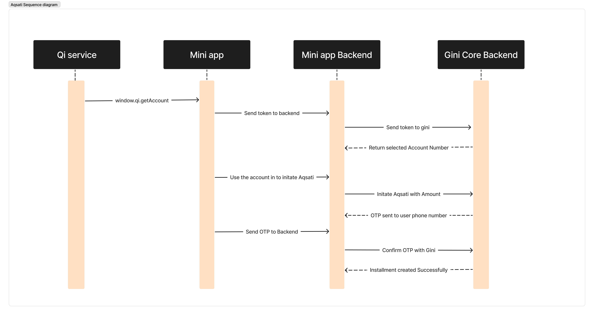
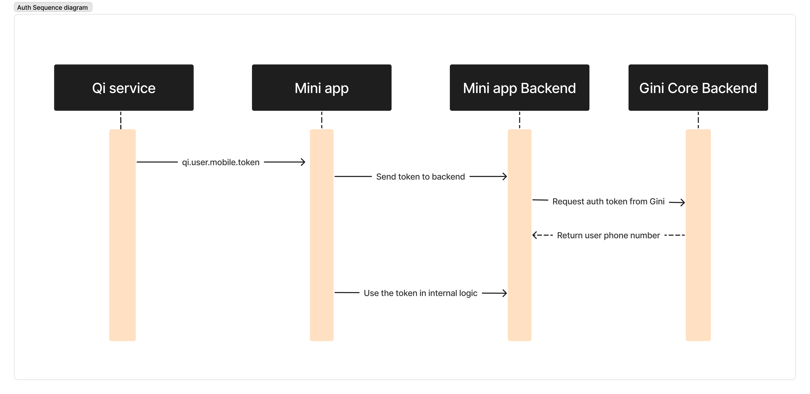

# Gini Core

# API Reference

This document provides the API reference for the Gini core that includes QiServices Mini Apps JavaScript SDK and Aqsati integration. It details available methods, their signatures, parameters, and callback types for interacting with QiServices platform features, including payments, account information, utility functions, and the new BNPL (Aqsati) functionality.

---

## Table of Contents

1. **Utility**
   - qi.close() - Closes the Mini App.
   - qi.isMiniApp() - Returns true if the web page is running inside the QiServices Mini App Platform.

2. **Financial**

   a. Qi Payment:
      - qi.purchase() - Shows a popup to the user to carry out a purchase operation.
      - qi.getAccount() - Shows a popup to the user to select the account to be shared with the Mini App.
      - Refund a payemnt.

   b. Aqsati (BNPL):
      - Initiates the BNPL (Aqsati) to the user after account selection.
      - Send or Resend OTP to selected account.
      - Confirms the BNPL (Aqsati) transaction after OTP verification.
      - Update an installment status.

4. **Functionality**
   - qi.readQr() - Opens the camera to scan a QR code and returns the raw value of the QR code.
   - qi.openURL() - Opens a URL in the browser or internally inside the QiServices App.
   - qi.getLocation() - Returns the user's current location (if permission is granted and the device has location services enabled).
  
5. **Authentication**
   - Retrieve Phone Number from Token.
   - Retrieve Account Number from Token.


### Utility

#### qi.isMiniApp()
Returns true if the web page is running inside the QiServices Mini App Platform.

**Signature:**
```typescript
isMiniApp: () => boolean
```


**Input Params:** None

**Callback Type:** None

---

#### qi.close()
Closes the Mini App.

**Signature:**
```typescript
close: () => void
```

---

## Financial

### Qi payment

   #### qi.getAccount()
   Shows a popup to the user to select the account to be shared with the Mini App.
   
   **Signature:**
   ```typescript
   getAccount: (callback: (result: AccountResult) => void) => void
   ```
   
   
   **Input Params:** None
   
   **Callback Type:**
   ```typescript
   {
     status: "'SUCCESSFUL' | 'CANCELLED'",
     account: SignedField<string>
   }
   ```
   
   ---
   
   #### qi.purchase()
   Shows a popup to the user to carry out a purchase operation. Check the purchase flow in purchase-flow.md for more details.
   
   **Signature:**
   ```typescript
   purchase: (options: PurchaseOptions, callback: (result: PurchaseResult) => void) => void
   ```
   
   
   **Input:**
   ```typescript
   
   {
     price: number;
     merchantTransactionID: string;
   }
   ```
   
   
   **Callback Type:**
   ```typescript
   {
     status: "'SUCCESSFUL' | 'CANCELLED' | 'FAILED'",
     transactionID: string;
     RRN?: string;
   }
   ```

   After getting the callback send a request 
   
   **URL**
    /v1.0/ginipay/qi-services/pay

   
   **Input**

   ```javascript
   {
     "merchant_transaction_id": "<string>", // Some Unique Transaction ID that you already parsed to qi.purchase() function
     "amount": "1000", // same amount you already parsed to qi.purchase() function (for checking)
     "rrn": "12312312321", // qi.purchase() function will return it
     "fee_id": "1", // // The transaction fee (predefined fees will be created to your account)
     "extrenal_customer_id": "1" // an ID from your system to tracking the user if you need it
   }
   ```

---
   
   ### Refund
   **URL**
   
   /v1.0/ginipay/qi-services/refund


   **Input**

   ```javascript
      {
        "transaction_uuid": "<string>"
      }
   
   ```

   **Output**
   
   ```javascript
   {
     "message": "<string>", 
     "data": null, 
   }
   ```

---


## Aqsati (BNPL)

   <details>
       <summary>Click to view the BNPL Flow Diagram</summary>
   
   
   </details>

### /v1.0/ginipay/aqsati/create
Initiates an Installment to the user after selecting an account from QiService.

**Input Params:** 
```typescript
{
  "account_number": "6330153657143355", // this is account number your can use it for testing
  "external_customer_id": "1" // an ID from your system to tracking the user if you need it
}
```

**Result**
```typescript
{
   "message": "Success"
   "data":null
}
```

---

### /v1.0/ginipay/aqsati/sendotp
Send or Resend OTP to the user after selecting an account from QiService.

**Input Params:** 
```typescript
{
  "transaction_uuid": "e2ce1893-2791-43de-a54c-ed7b434b6da4", // from the step [1]
  "amount": "100000", // the amount of the transaction
  "count_of_month": "10", // Number of months for which the amount was paid in installments 
  "type_of_installment": "1", // The type of installment if 1 it's pending if 2 it's active
  "fee_id": "1" // The transaction fee (predefined fees will be created to your account)
}
```

**Result**
```typescript
{
   "message": "Success"
   "data":null
}
```

---


### /v1.0/ginipay/aqsati/confirm
Confirms the BNPL (Aqsati) transaction after the user enters the OTP.

**Input:**
```typescript
{
  "transaction_uuid": "e2ce1893-2791-43de-a54c-ed7b434b6da4", // from step [1]
  "otp": "22331144", // this OTP 22331144 to testing use
  "note": "any notes you need"
}
```


**Result**
```typescript
{
   "message": "Success"
   "data":null
}
```


---

### /v1.0/ginipay/aqsati/update
Update the Status of an Installment transaction.

**Input:**
```typescript
{
  "status": "1", //  1 to confirmed it and 4 to archived it (close)
  "transaction_uuid": "e2ce1893-2791-43de-a54c-ed7b434b6da4"
}
```


**Result**
```typescript
{
   "message": "Success"
   "data":null
}
```


---


## Functionality

### qi.readQr()
Opens the camera to scan a QR code and returns the raw value of the QR code.

**Signature:**
```typescript
readQr: (callback: (result: QRResult) => void) => void
```

**Input Params:** None

**Callback Type:**
```typescript
{
  status: "'SUCCESSFUL' | 'CANCELLED'",
  value: string;
}
```


---

### qi.getLocation()
Returns the user's current location (if permission is granted and the device has location services enabled).

**Signature:**
```typescript
getLocation: (callback: (result: LocationResult) => void) => void
```

**Input Params:** None

**Callback Type:**
```typescript
{
  status: "'SUCCESSFUL' | 'CANCELLED' | 'REJECTED'",
  longitude?: number;
  latitude?: number;
  accuracy?: number;
}
```


---

### qi.openURL()
Opens a URL in the browser or internally inside the QiServices App.

**Signature:**
```typescript
openURL: (options: OpenURLOptions, callback: (result: OpenURLResult) => void) => void
```

**Input Params:**
```typescript
{
  url: string;
  type: "EXTERNAL" | "INTERNAL";
}
```

**Callback Type:**
```typescript
{
  url: string;
  status: "APP_CLOSE" | "USER_CLOSE" | "IMMEDIATE_CLOSE";
}
```


## User Authentication Flow

<details>
    <summary>Click to view the Auth Flow Diagram</summary>
   

</details>

### Retrieve Phone Number by token
Retrieve the phone number associated with the provided authentication token.

**URL**

/v1.0/giniidentity/qi-services/get-phone

**Result**
```typescript
{
   "data":{"phone":"+96412332112"}
}
```

**Input Params:** 
```typescript
{
  "token": "<string>"
}
```


---

### Account Number by token
Retrieve the Account number associated with the provided authentication token.

**URL**

/v1.0/giniidentity/qi-services/get-account

**Result**
```typescript
{
   "data":{"account":"123456789"}
}
```

**Input Params:** 
```typescript
{
  "token": "<string>"
}
```
